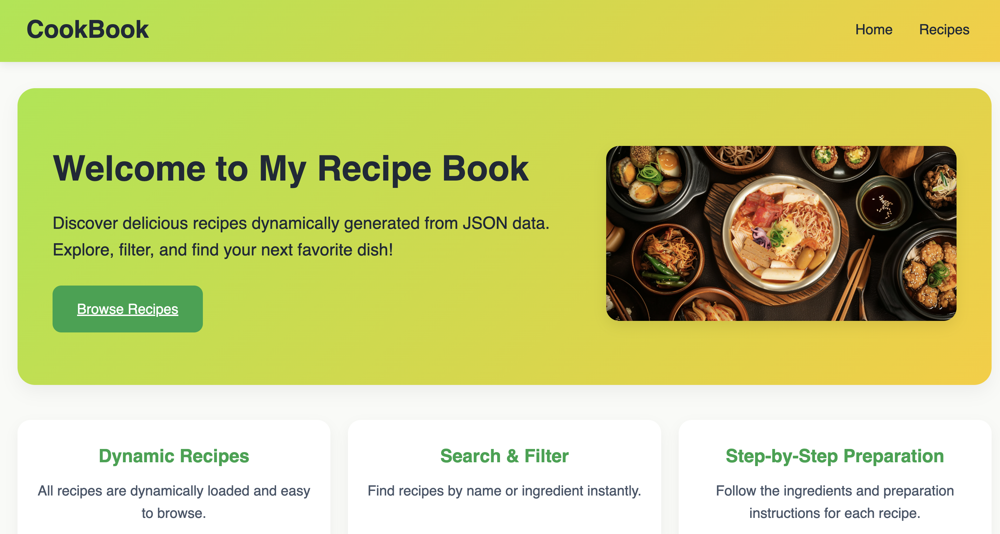

# Claudia Safta - Personal Portfolio



## Description

This is my personal front-end portfolio built with **React**, **Tailwind CSS**, and **React Router**.  
It showcases my projects, skills, and ways to contact me. The portfolio supports **dark/light mode** toggle and is fully responsive.

---

## Features

- Home page with animated Hero section
- Projects page with reusable ProjectCard components
- Image slider/carousel for project screenshots
- Technology badges for each project
- Contact form with validation
- Social links (GitHub, LinkedIn, Email)
- Dark/Light mode toggle
- Back to top button
- Fully responsive design

---

## Technologies Used

- React
- Tailwind CSS
- React Router
- Lucide Icons
- Framer Motion (for animations)

---

## Installation

1. Clone the repository:

```bash
git clone https://github.com/saftaclaudia/my-portfolio.git
```
